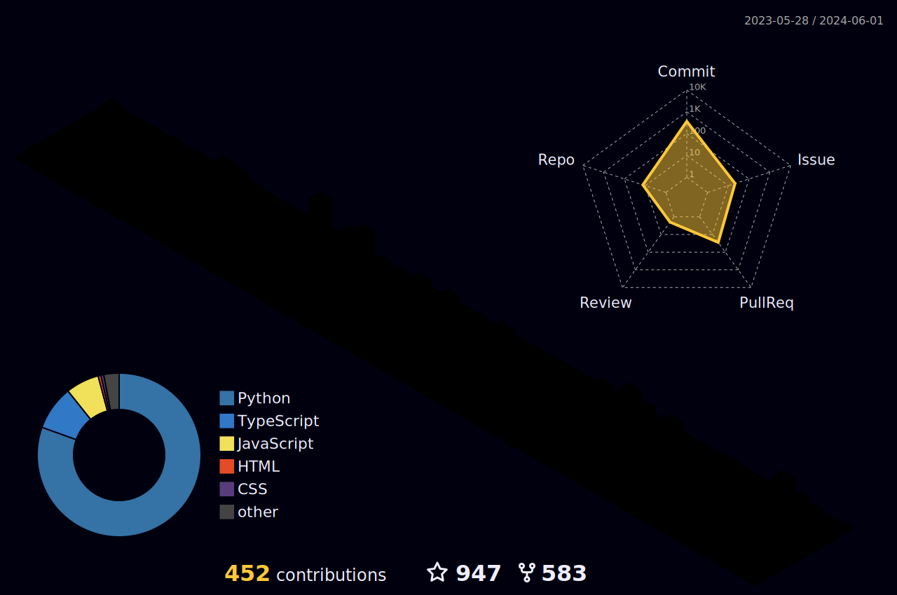

  
  
  
  

<h1 align="center">
  
  Hey &lt;TechWithNani&gt;!
  
</h1>

<h4 align="center">
  <I>I'm a seasoned Cloud Architect, weaving innovation through code orchestration. Skilled in AWS, GCP, Kubernetes, CI/CD, Terraform. Mentor shaping futures. Embracing challenges, crafting solutions.</I>
</h4>

 
 

####  🌱 𝙸’𝚖 Cloud Architect

 𝙸’𝚖 𝚕𝚘𝚘𝚔𝚒𝚗𝚐 𝚝𝚘 𝚌𝚘𝚕𝚕𝚊𝚋𝚘𝚛𝚊𝚝𝚎 𝚘𝚗 **more and more Open source projects**

 Interested in **Open source | DevOps| FinOps| Cloud Security | Multi-Cloud | cybersecurity**

 
 

 

#

 

**𝙻𝙰𝙽𝙶𝚄𝙰𝙶𝙴𝚂 𝙰𝙽𝙳 𝚃𝙾𝙾𝙻𝚂:**  
 
 

<code></code>
<code></code>
<code></code>
<code></code>
<code></code>

# 

<code></code>
<code></code>
<code></code>
<code></code>
<code></code>

 

# 𝙂𝙞𝙩𝙃𝙪𝙗 𝙎𝙩𝙖𝙩𝙨

  

 

  <g-emoji class="g-emoji" alias="chart_with_upwards_trend" fallback-src="https://github.githubassets.com/images/icons/emoji/unicode/1f4c8.png">📈</g-emoji>
  <strong>𝙶𝚒𝚝𝚑𝚞𝚋 𝚂𝚝𝚊𝚝𝚜 : </strong>

 

  
  

<!---->

 
 

<!---->

# Connect With Me

   
  
  <a href="https://www.linkedin.com/in/naveenchinnaboina/" target="_blank">
    <code></code>    
  </a>

### 𝚂𝚑𝚘𝚠 𝚜𝚘𝚖𝚎 ❤️ 𝚋𝚢 𝚜𝚝𝚊𝚛𝚛𝚒𝚗𝚐 𝚜𝚘𝚖𝚎 𝚘𝚏 𝚝𝚑𝚎 𝚛𝚎𝚙𝚘𝚜𝚒𝚝𝚘𝚛𝚒𝚎𝚜!

